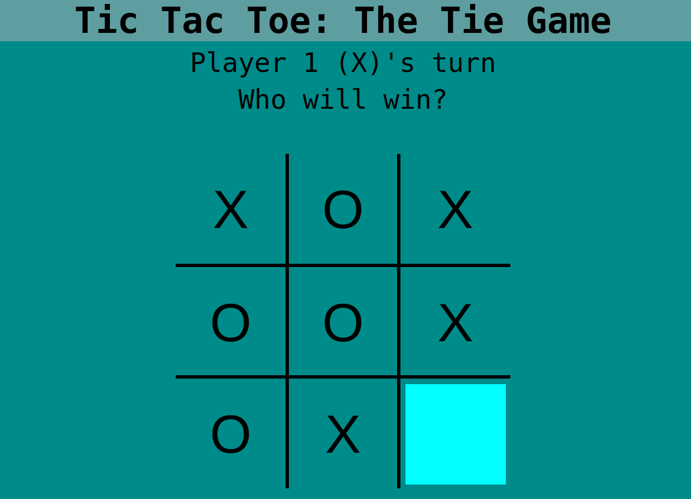

# full-stack-tictactoe
An in-browser game of Tic Tac Toe

# Preview

    

# Links

-[Assignment Page (Jan '24)](https://www.theodinproject.com/lessons/node-path-javascript-tic-tac-toe)

-[Finished Project](https://erreurdesyntaxe.github.io/full-stack-TicTacToe/)

# Notable Features

-HTML  
-CSS  
-JavaScript  
-OOP  
-factory functions  
-scope  
-modules  

# Challenges

-Getting started with the project  
-OOP  
-factory functions  

# Diary

I relied heavily on tutorials and guides to do this project. The concept of
factory functions was difficult to grasp, and I am still unsure whether I have
learned something or if it was just mechanical without any understanding. 